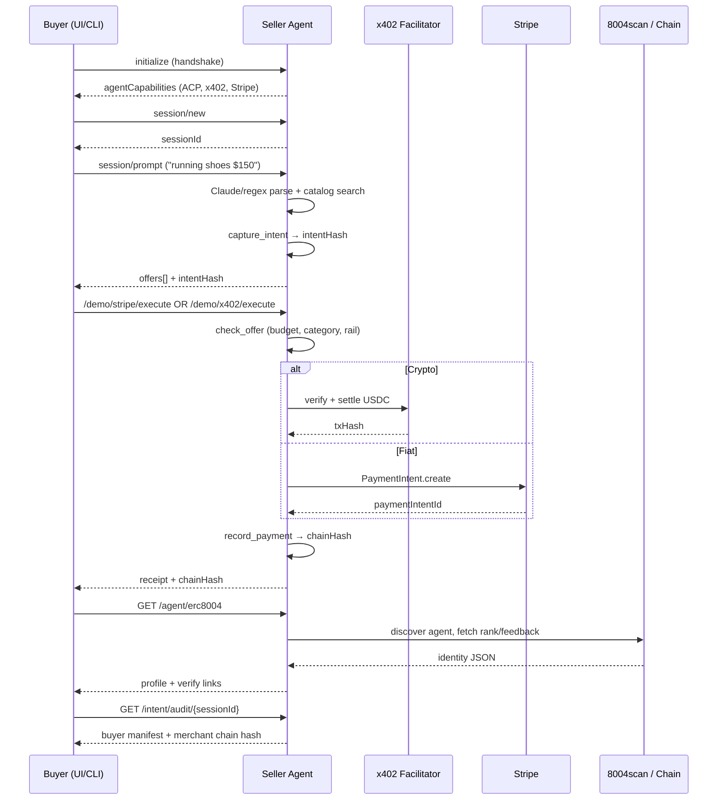

# Agentic Commerce Demo — Full Project Context for LLM / Hackathon Prototyping

> **Purpose:** This document is a self-contained brief for another IDE or LLM (e.g. RequireContext) to understand, reproduce, or extend an **agentic commerce** prototype. It describes a working Nike-themed buyer ↔ seller demo that combines negotiation, dual-rail payment, on-chain agent identity, and auditable buyer intent.

**Author:** Dheeraj Maske  
**Theme:** Agentic Commerce — AI agents that discover, negotiate, pay, and audit purchases autonomously  
**Thesis:** Commerce between AI agents needs **intent** (what the buyer authorized), **session** (multi-turn conversation), **payment** (money that moves), **trust** (verifiable identity), and **audit** (proof payment matched constraints).

---

## Table of Contents

1. [Executive Summary](#1-executive-summary)
2. [Hackathon Prototype Goals](#2-hackathon-prototype-goals)
3. [Architecture Overview](#3-architecture-overview)
4. [Protocol Stack (Five Layers)](#4-protocol-stack-five-layers)
5. [End-to-End User Flow](#5-end-to-end-user-flow)
6. [ACP JSON-RPC API Reference](#6-acp-json-rpc-api-reference)
7. [REST API Reference (Non-JSON-RPC)](#7-rest-api-reference-non-json-rpc)
8. [Verifiable Intent (VI) Layer](#8-verifiable-intent-vi-layer)
9. [Data Models & Schemas](#9-data-models--schemas)
10. [Codebase Map](#10-codebase-map)
11. [Key Implementation Details](#11-key-implementation-details)
12. [Environment Variables](#12-environment-variables)
13. [Local Development](#13-local-development)
14. [Deployment Architecture](#14-deployment-architecture)
15. [UI Structure (`demo.html`)](#15-ui-structure-demohtml)
16. [What's Built vs Production Gaps](#16-whats-built-vs-production-gaps)
17. [Suggested Hackathon Extensions](#17-suggested-hackathon-extensions)
18. [Example API Payloads](#18-example-api-payloads)
19. [Live Demo URLs](#19-live-demo-urls)
20. [References & Inspiration](#20-references--inspiration)

---

## 1. Executive Summary

This project is an **8-day incremental build** of a Nike shoe commerce demo where:

- A **buyer agent** (CLI script or browser UI) negotiates with a **seller agent** (FastAPI server).
- Communication uses **ACP (Agent Client Protocol)** over JSON-RPC 2.0.
- Payment settles on **two rails**: **x402 USDC** (Base Sepolia) or **Stripe fiat** (test mode).
- The seller has a verifiable **ERC-8004** on-chain identity browsable on **8004scan**.
- A **Verifiable Intent (VI)** layer captures buyer constraints, enforces them before payment, and produces a **hash chain** for audit.

**One-liner:** Nike agentic commerce — ACP for negotiation, x402 and Stripe for payment, ERC-8004 for who the seller is, VI for what the buyer authorized.

---

## 2. Hackathon Prototype Goals

If you are rebuilding or extending this in a hackathon under the **agentic commerce** theme, aim to demonstrate:

| Capability | Why it matters | Status in this repo |
|------------|----------------|---------------------|
| Agent handshake & capability negotiation | Proves two agents can interoperate | ✅ `initialize` |
| Stateful multi-turn session | Real commerce is conversational, not one-shot | ✅ `session/*` |
| Natural language → catalog → offers | Buyer expresses intent in plain English | ✅ `session/prompt` + Claude/regex |
| Autonomous payment (crypto + fiat) | Money actually moves | ✅ x402 + Stripe |
| Verifiable seller identity | Trust before paying an unknown agent | ✅ ERC-8004 + 8004scan |
| Buyer intent capture & enforcement | Prevents overspend / wrong category | ✅ VI hash chain |
| Visual demo UI | Judges need to see the flow | ✅ `demo.html` three-column stage |

**Minimum viable hackathon demo path:**

1. Handshake → Session → Prompt (*"running shoes at $150"*) → Pick offer → Pay (Crypto or Fiat) → ERC-8004 feedback → Verify intent.

---

## 3. Architecture Overview

```
┌─────────────────────────────────────────────────────────────────────────────┐
│                         FRONTEND (Static)                                   │
│  demo.html — Netlify OR python -m http.server 8080                          │
│  Three columns: Buyer | Protocol spine | Seller                             │
│  Calls seller API only (no separate buyer server in demo)                   │
└───────────────────────────────┬─────────────────────────────────────────────┘
                                │ HTTPS / JSON-RPC POST /
                                │ REST GET/POST /wallet/*, /agent/*, /intent/*
                                ▼
┌─────────────────────────────────────────────────────────────────────────────┐
│                    SELLER AGENT (FastAPI — Port 8002)                       │
│  seller_agent.py                                                            │
│  ┌─────────────┐ ┌──────────────┐ ┌────────────┐ ┌──────────┐ ┌─────────┐ │
│  │ session_    │ │ search.py +  │ │ payments/  │ │ trust/   │ │ intent/ │ │
│  │ manager.py  │ │ catalog.py   │ │ x402 stripe│ │ erc8004  │ │ VI layer│ │
│  └─────────────┘ └──────────────┘ └────────────┘ └──────────┘ └─────────┘ │
└───────────────────────────────┬─────────────────────────────────────────────┘
                                │
          ┌─────────────────────┼─────────────────────┐
          ▼                     ▼                     ▼
   x402.org Facilitator    Stripe API           Base Sepolia RPC
   (USDC settle)           (test cards)         + 8004scan API
```

**Optional CLI buyer:** `buyer_agent.py` — terminal script that runs handshake → session → commerce/request → commerce/pay → close.

**Important deployment split:**

- **Netlify** hosts static `demo.html` only.
- **Railway** hosts the seller FastAPI backend.
- ERC-8004 registration points at the **Railway URL**, not Netlify.

---

## 4. Protocol Stack (Five Layers)

| Layer | Protocol / Standard | Question it answers | Implementation |
|-------|---------------------|---------------------|----------------|
| **Negotiation** | ACP (Agent Client Protocol) | Can agents agree on an offer? | JSON-RPC: `initialize`, `session/*`, `commerce/*` |
| **Settlement (crypto)** | x402 + USDC on Base Sepolia | Did USDC payment settle on-chain? | `commerce/pay`, `/demo/x402/execute`, x402.org facilitator |
| **Settlement (fiat)** | Stripe test mode | Did fiat payment complete? | `/demo/stripe/execute`, `commerce/pay` with `payment_method: fiat` |
| **Trust** | ERC-8004 + 8004scan | Who is this seller agent? | `GET /agent/erc8004`, on-chain registry reads |
| **Intent / Audit** | Verifiable Intent (demo subset) | Was payment within buyer constraints? | `intent/` package, hash chain, constraint guard |

### Layer interaction (mermaid)



---

## 5. End-to-End User Flow

### Step-by-step (demo.html)

| Step | User action | Backend | Protocol badge |
|------|-------------|---------|----------------|
| 1 | Click **Start** | — | — |
| 2 | **Handshake** | `POST /` method `initialize` | ACP |
| 3 | **Session** | `session/new` | ACP |
| 4 | Type prompt e.g. *"I need running shoes at $150"* | `session/prompt` | ACP |
| 4b | (If no budget) Seller asks clarification | `stopReason: needs_clarification` | ACP |
| 5 | Pick one of 3 offers | UI stores selected offer | ACP |
| 6 | Choose **Crypto (USDC)** or **Fiat (Stripe ···4242)** | — | x402 / Stripe |
| 7 | **Pay** | `/demo/x402/execute` or `/demo/stripe/execute` | x402 / Stripe |
| 8 | **Give feedback** (optional) | `POST /demo/erc8004/feedback` | ERC-8004 |
| 9 | **Verify intent** | `GET /intent/audit/{sessionId}` | VI |

### Multi-turn prompt logic

The seller stores session context for budget clarification:

- **Turn 1** (no budget in message): `needs_clarification`, sets `awaiting_budget: true`, stores `pending_query`.
- **Turn 2** (buyer gives budget): combines stored query + budget → catalog search → up to 3 offers.
- **Turn 1 with budget** (e.g. *"running shoes at $150"*): skips clarification, searches immediately.

Intent parsing uses **Claude Haiku** when `ANTHROPIC_API_KEY` is set; otherwise regex fallback.

---

## 6. ACP JSON-RPC API Reference

**Endpoint:** `POST /`  
**Format:** JSON-RPC 2.0

```json
{
  "jsonrpc": "2.0",
  "id": 1,
  "method": "<method_name>",
  "params": { }
}
```

### `initialize`

Handshake. Buyer announces capabilities; seller responds with agent info and supported features.

**Params (buyer → seller):**
```json
{
  "protocolVersion": 1,
  "clientInfo": { "name": "buyer-agent", "title": "Nike Buyer Agent", "version": "2.0.0" },
  "clientCapabilities": { "fs": { "readTextFile": true }, "terminal": false }
}
```

**Result (seller → buyer):**
```json
{
  "protocolVersion": 1,
  "agentInfo": { "name": "nike-seller-agent", "title": "Nike Seller Agent", "version": "2.0.0" },
  "agentCapabilities": {
    "loadSession": true,
    "sessionCapabilities": { "resume": {}, "close": {} },
    "commerce": {
      "canSell": true,
      "itemCount": 100,
      "categories": ["running", "lifestyle", "training", "basketball", "trail", "soccer", "golf", "sandals", "kids"],
      "acceptedCurrencies": ["USD"],
      "negotiation": false
    },
    "payment": { "stripe": true, "stripeConnect": true, "x402": true },
    "mcpCapabilities": { "http": false, "sse": false }
  },
  "authMethods": []
}
```

### `session/new`

Create a new conversation session.

**Params:** `{ "buyerId": "buyer-agent-v2.0.0", "cwd": "/" }`  
**Result:** `{ "sessionId": "sess_abc123def456" }`

### `session/load`

Replay full session history (demo returns inline JSON; production would use SSE).

**Params:** `{ "sessionId": "sess_...", "cwd": "/", "mcpServers": [] }`  
**Result:** `{ "sessionId", "buyerId", "cwd", "createdAt", "history": [...] }`

### `session/resume`

Silent reconnect without history replay.  
**Result:** `{}` (empty on success)

### `session/cancel`

Abort in-flight work but keep session open.  
**Result:** `{}`

### `session/close`

End session and free server memory.  
**Result:** `{}`

### `session/prompt`

Natural-language buyer message. Core agentic commerce method.

**Params:**
```json
{
  "sessionId": "sess_...",
  "prompt": [{ "type": "text", "text": "I need comfortable running shoes at $150" }]
}
```

**Result (offers ready):**
```json
{
  "stopReason": "end_turn",
  "agentMessage": "Found 3 matches. Best fit: Nike Air Zoom Pegasus 41 — $130. ...",
  "parsedIntent": { "query": "comfortable running shoes", "max_price": 150 },
  "usedClaude": true,
  "intentHash": "a1b2c3...",
  "intentCapturedAt": "2026-06-22T12:00:00Z",
  "offers": [
    {
      "id": "pegasus_41",
      "name": "Nike Air Zoom Pegasus 41",
      "description": "The everyday workhorse — responsive zoom, smooth ride",
      "price": 130,
      "currency": "USD",
      "category": "running",
      "score": 0.87,
      "payment_required": true,
      "status": "offer_ready",
      "seller_agent": "nike-seller-agent-v2.0.0"
    }
  ]
}
```

**Result (needs budget):**
```json
{
  "stopReason": "needs_clarification",
  "agentMessage": "What's your budget for this purchase?",
  "parsedIntent": { "query": "running shoes", "max_price": null },
  "awaitingBudget": true,
  "offers": []
}
```

### `commerce/request`

Legacy Day-1 direct item request (requires known catalog ID).

**Params:** `{ "sessionId", "item": "air_max_270", "max_price": 200, "buyer_id": "..." }`  
**Result:** `{ "offer": { "id", "name", "price", "currency", "status": "offer_ready", ... } }`

### `commerce/pay`

Unified payment method — routes to x402 or Stripe.

**Quote (crypto):**
```json
{
  "sessionId": "sess_...",
  "offerId": "pegasus_41",
  "offer": { "id": "pegasus_41", "price": 130 }
}
```

**Execute (crypto):**
```json
{
  "sessionId": "sess_...",
  "offerId": "pegasus_41",
  "offer": { ... },
  "execute": true
}
```

**Fiat path:** add `"payment_method": "fiat"`.

**Quote result:** `{ "status": "payment_required", "offerId", "fx": { "catalogUsd", "usdc", "usdcAtomic", "demoRate" }, "x402": { ... } }`  
**Paid result:** `{ "status": "paid", "receipt": { "txHash", "usdcPaid", "explorer", "intentHash", "paymentHash", "chainHash", ... } }`

---

## 7. REST API Reference (Non-JSON-RPC)

| Method | Path | Purpose |
|--------|------|---------|
| GET | `/` | Health check: catalog count, wallet status, erc8004 config |
| GET | `/wallet/buyer` | Buyer USDC/ETH balances + recent txs (Base Sepolia) |
| GET | `/wallet/seller` | Seller receive address + balances |
| GET | `/wallet/buyer/fiat` | Stripe buyer test card info |
| GET | `/wallet/seller/fiat` | Stripe seller account summary |
| GET | `/agent/erc8004` | Full ERC-8004 identity, rank, feedback, verify links |
| POST | `/demo/x402/execute` | One-shot x402 quote+sign+settle (demo UI) |
| POST | `/demo/stripe/execute` | One-shot Stripe charge (demo UI) |
| POST | `/demo/erc8004/feedback` | Submit on-chain giveFeedback after payment |
| POST | `/demo/receipt.pdf` | Download PDF receipt |
| GET | `/demo/tx-fee?tx=0x...` | Poll facilitator gas fee for settlement tx |
| GET | `/intent/constraints` | Public constraint vocabulary |
| POST | `/intent/capture` | Explicit intent capture |
| POST | `/intent/check` | Pre-payment constraint check |
| GET | `/intent/manifest/{sessionId}` | Buyer audit view (full manifest) |
| GET | `/intent/merchant/{sessionId}` | Merchant audit view (limited metadata) |
| GET | `/intent/audit/{sessionId}` | Full buyer + merchant audit |
| GET | `/intent-demo.html` | Standalone VI test page |
| GET | `/demo.html` | Serve demo UI from seller (optional) |

---

## 8. Verifiable Intent (VI) Layer

Inspired by [agent-intent/verifiable-intent](https://github.com/agent-intent/verifiable-intent) but kept **demo-sized**: capture, hash, enforce, log — not full signed L1/L2/L3 mandates.

### Hash chain

| Hash | Input | Who holds full data |
|------|-------|---------------------|
| `intentHash` | `sha256(canonical_json(manifest))` | Buyer (full manifest) |
| `paymentHash` | Rail-specific receipt fields | Buyer |
| `chainHash` | `sha256({ intent_hash, payment_hash })` | Buyer + merchant |

**Canonical JSON:** `json.dumps(obj, sort_keys=True, separators=(",", ":"))`

### Default constraint policy

Enforced **before** `PaymentIntent.create()` or x402 settle:

1. `offer.price <= budget.max`
2. `offer.category in categories.allowed` (inferred from prompt text, default `["running"]`)
3. `payment_rail` must be `stripe_fiat` or `x402`

Result: `PASS` or `FAIL` with logged `intentHash`.

### Two-copy audit model

| Party | Holds |
|-------|-------|
| **Buyer** | Full manifest (prompt, constraints, timestamp), all hashes |
| **Merchant** | `chainHash`, selected offer metadata, constraint check result, payment id — **no full manifest** |

### Auto-capture

When `session/prompt` returns offers, `_build_offers()` automatically calls `intent_service.capture_intent()` and includes `intentHash` in the response.

### Payment guard flow

```
check_offer_for_session()  →  run_checks()  →  PASS/FAIL
        ↓ (if PASS)
stripe/x402 execute payment
        ↓
finalize_paid_receipt()  →  record_payment()  →  chainHash on receipt
```

---

## 9. Data Models & Schemas

### Session object (in-memory)

```python
{
  "sessionId": "sess_abc123def456",
  "buyerId": "buyer-agent-v2.0.0",
  "cwd": "/",
  "status": "active",
  "createdAt": "2026-06-22T12:00:00",
  "history": [
    { "role": "buyer", "method": "session/prompt", "content": {...}, "timestamp": "..." },
    { "role": "seller", "method": "session/prompt.response", "content": {...}, "timestamp": "..." }
  ],
  "context": {
    "awaiting_budget": false,
    "pending_query": "",
    "turn": 1,
    "paidOffers": { "pegasus_41": { "status": "paid", "receipt": {...} } }
  },
  "processing": false,
  "cancelled": false
}
```

### Intent manifest

```python
{
  "session_id": "sess_...",
  "captured_at": "2026-06-22T12:00:00Z",
  "prompt": "I need running shoes at $150",
  "prompt_summary": "running shoes",
  "constraints": {
    "budget_max_cents": 15000,
    "currency": "USD",
    "categories_allowed": ["running"],
    "payment_rails_allowed": ["stripe_fiat", "x402"],
    "payment_rail": "stripe_fiat",
    "merchants_allowed": ["nike.com"]
  },
  "buyer_agent_id": "buyer-demo-agent",
  "seller_agent_id": "nike-seller-agent-v2.0.0"
}
```

### Catalog item

```python
{
  "name": "Nike Air Zoom Pegasus 41",
  "price": 130.00,
  "currency": "USD",
  "category": "running",  # running | lifestyle | training | basketball | trail | soccer | golf | sandals | kids
  "keywords": ["running", "pegasus", "zoom", ...],
  "description": "The everyday workhorse — responsive zoom, smooth ride"
}
```

100 items in `catalog.py`. Search via keyword overlap + difflib fuzzy match in `search.py`.

### x402 demo FX

`DEMO_CATALOG_USD_PER_USDC=10000` means $100 catalog price → 0.01 USDC on-chain (demo rate, not market FX).

---

## 10. Codebase Map

```
acp-demo/
├── seller_agent.py          # Main FastAPI app — JSON-RPC + REST routes
├── buyer_agent.py           # CLI buyer (handshake → session → pay → close)
├── session_manager.py       # In-memory session state + history
├── catalog.py               # 100 Nike items dict
├── search.py                # CatalogSearch — fuzzy search (swappable for vector DB)
├── demo.html                # Three-column interactive demo UI (~6800 lines)
├── intent/
│   ├── CONSTRAINTS.md       # Human-readable policy vocabulary
│   ├── constraints.py       # Default policy + category inference
│   ├── manifest.py          # Manifest build + all hash functions
│   ├── check.py             # Budget/category/rail enforcement
│   ├── store.py             # In-memory audit store per session
│   ├── service.py           # capture_intent, check_offer, record_payment, audit views
│   ├── payment_guard.py     # Shared guard for payment endpoints
│   ├── api.py               # HTTP handlers for /intent/* routes
│   └── intent-demo.html     # Standalone VI Stripe walkthrough page
├── payments/
│   ├── commerce_pay.py      # commerce/pay router (crypto vs fiat)
│   ├── x402_service.py      # x402 quote + execute via x402.org facilitator
│   ├── stripe_service.py    # Stripe test PaymentIntent flow
│   ├── wallets.py           # Buyer/seller wallet roles + key loading
│   ├── wallet_api.py        # REST wallet response builders
│   ├── chain.py             # Base Sepolia RPC reads (USDC, ETH, tx fee)
│   ├── config.py            # Env var helpers
│   ├── demo_fx.py           # Catalog USD → USDC atomic conversion
│   ├── fiat_wallet.py       # Stripe test card metadata
│   └── receipt_pdf.py       # PDF receipt generator (fpdf2)
├── trust/
│   ├── config.py            # Chain ID, registry addresses, 8004scan URLs
│   ├── scan8004.py          # 8004scan API + agent discovery by service URL
│   ├── registry_chain.py    # On-chain ownerOf, tokenURI, getAgentWallet
│   ├── metadata.py          # IPFS/HTTPS registration JSON fetch
│   ├── identity_api.py      # GET /agent/erc8004 response builder
│   └── feedback_service.py  # giveFeedback on Reputation Registry
├── local.env.example        # All env vars documented
├── requirements.txt         # Python dependencies
├── Procfile                 # Railway: uvicorn seller_agent:app
├── railway.json             # Deploy config + healthcheck
└── netlify.toml             # Static demo.html hosting
```

---

## 11. Key Implementation Details

### JSON-RPC dispatch

All ACP methods hit `POST /` in `seller_agent.py`. Unknown methods return JSON-RPC error `-32601`.

### Claude intent parsing

- Model: `claude-haiku-4-5`
- System prompt asks for JSON: `{ intent, max_price, needs_clarification, response_message }`
- Regex budget override if Claude omits `max_price` but message contains `$150` etc.

### x402 payment

- Network: `eip155:84532` (Base Sepolia)
- Scheme: `exact` USDC via Circle testnet contract
- Facilitator: `https://x402.org/facilitator`
- `DEMO_SERVER_SIGN=true`: seller signs buyer USDC tx (single-service demo convenience)

### Stripe payment

- Platform key charges buyer test card `4242`
- Optional separate seller Stripe account for seller-side receipt visibility
- Metadata includes `intentHash`, `checkoutHash`, `constraintCheck`

### ERC-8004 identity

- Registered agent: **Attention Agent #6832** on Base Sepolia
- Auto-discovery: match seller public URL against 8004scan when `ERC8004_AGENT_ID` omitted
- Profile UI: seller header **◎** popover with ID · Rank · Feedback · Verify tabs

### Search modularity

Replace `CatalogSearch._search_impl()` or swap `catalog_search = PineconeSearch(CATALOG)` — `session/prompt` handler unchanged.

---

## 12. Environment Variables

Copy `local.env.example` → `local.env` (gitignored). Load via `python-dotenv`.

### Minimum for full demo

```bash
# Optional — Claude intent parsing (regex fallback if missing)
ANTHROPIC_API_KEY=

# Crypto wallets (Base Sepolia)
BUYER_WALLET_PRIVATE_KEY=0x...
BUYER_WALLET_ADDRESS=0x...
SELLER_PAYTO_ADDRESS=0x...

X402_NETWORK=eip155:84532
X402_FACILITATOR_URL=https://x402.org/facilitator
BASE_SEPOLIA_RPC=https://sepolia.base.org
USDC_CONTRACT_ADDRESS=0x036CbD53842c5426634e7929541eC2318f3dCF7e
EXPLORER_BASE_URL=https://sepolia.basescan.org
DEMO_CATALOG_USD_PER_USDC=10000
DEMO_SERVER_SIGN=true

# ERC-8004
SCAN8004_API_KEY=
ERC8004_AGENT_ID=6832
ERC8004_SERVICE_URL=https://acp-demo-production.up.railway.app

# Stripe (fiat path)
STRIPE_SECRET_KEY=sk_test_...
STRIPE_SELLER_SECRET_KEY=sk_test_...   # optional
STRIPE_SELLER_ACCOUNT_ID=acct_...      # optional Connect
```

---

## 13. Local Development

```bash
cd acp-demo
python3 -m venv venv
source venv/bin/activate
pip install -r requirements.txt

cp local.env.example local.env
# Fill in keys

# Terminal 1 — seller agent
uvicorn seller_agent:app --host 0.0.0.0 --port 8002 --reload

# Terminal 2 — static UI
python3 -m http.server 8080
# Open http://localhost:8080/demo.html

# Optional CLI buyer
python buyer_agent.py

# VI standalone test page
# http://localhost:8002/intent-demo.html
```

**Smoke test:** Start → Handshake → Session → *"running shoes at $150"* → pick offer → Pay → Feedback → Verify intent.

**Note:** 8004scan registers Railway URL, not localhost. For local ◎ profile, set `ERC8004_SERVICE_URL` or `ERC8004_AGENT_ID=6832`.

---

## 14. Deployment Architecture

| Component | Platform | URL |
|-----------|----------|-----|
| Frontend (`demo.html`) | Netlify | https://dheeraj-agentic-communication-demo.netlify.app |
| Backend (`seller_agent.py`) | Railway | https://acp-demo-production.up.railway.app |
| ERC-8004 agent | Base Sepolia | https://testnet.8004scan.io/agents/base-sepolia/6832 |

**Frontend seller URL logic (`demo.html`):**
```javascript
const SELLER = (location.hostname === 'localhost' || location.hostname === '127.0.0.1' || location.protocol === 'file:')
  ? 'http://localhost:8002'
  : 'https://acp-demo-production.up.railway.app';
```

**Railway start command:** `uvicorn seller_agent:app --host 0.0.0.0 --port $PORT`  
**Healthcheck:** `GET /`

---

## 15. UI Structure (`demo.html`)

Three-column **stage**:

| Column | Role | Contents |
|--------|------|----------|
| Left | Buyer agent | Chat feed, wallet popover, VI audit cards (buyer view) |
| Center | Protocol spine | Vertical flow groups: ACP → x402/Stripe → ERC-8004 → VI |
| Right | Seller agent | Chat feed, ◎ ERC-8004 profile, wallet popover, VI audit cards (merchant view) |

**Footer controls:** Start, Handshake, Session, Prompt input, Offer picker, Payment rail selector, Pay, Feedback, Verify intent.

**Design:** DM Mono font, minimal grayscale, mobile-responsive grid.

---

## 16. What's Built vs Production Gaps

| Feature | Demo | Production would need |
|---------|------|----------------------|
| Session storage | In-memory dict | Redis / PostgreSQL with TTL |
| Intent audit | In-memory | Durable store or buyer-held signed manifest |
| Intent capture | Auto on offers | Explicit signed buyer mandate |
| Hash chain | Receipt JSON | On-chain or notarized anchor |
| Session replay | Inline history in HTTP response | SSE / WebSocket streaming |
| Buyer agent | Same process as seller (demo sign) | Separate buyer service with own keys |
| VI mandates | Auditable hashes | Signed L1/L2/L3 per full VI spec |
| Catalog search | Keyword + fuzzy | Vector DB / MCP inventory tool |

### ACP compliance checklist

| Requirement | Status |
|-------------|--------|
| `initialize` handshake | ✅ |
| Session layer (new/load/resume/close/cancel) | ✅ |
| `session/prompt` multi-turn | ✅ |
| Catalog search + offer selection | ✅ |
| `commerce/pay` crypto + fiat | ✅ |
| ERC-8004 profile + feedback | ✅ |
| Intent capture + constraint enforcement | ✅ |
| Payment-to-intent chain hash | ✅ |
| Signed verifiable mandates | ❌ |
| Separate buyer payment service | ❌ |
| SSE streaming | ❌ |

---

## 17. Suggested Hackathon Extensions

Prioritized ideas that fit **agentic commerce** theme:

1. **Buyer-side trust gate** — Fetch `/agent/erc8004` and block pay if rank below threshold.
2. **Persistent intent store** — SQLite append-only audit log in `intent/store.py`.
3. **Split buyer server** — New `buyer_server.py` on :8001; buyer owns signing keys + manifest.
4. **SSE live updates** — Stream payment verify/settle steps to center column in real time.
5. **MCP catalog tool** — Replace in-memory search with MCP `search_inventory` call.
6. **Multi-merchant routing** — Buyer agent discovers sellers via ERC-8004 service endpoints.
7. **Signed mandate prototype** — ECDSA sign manifest at capture time (step toward full VI).
8. **Different vertical** — Swap `catalog.py` for electronics, travel, or B2B supplies; keep protocol stack.

---

## 18. Example API Payloads

### Handshake

```bash
curl -s -X POST http://localhost:8002/ \
  -H 'Content-Type: application/json' \
  -d '{"jsonrpc":"2.0","id":1,"method":"initialize","params":{"protocolVersion":1,"clientInfo":{"name":"buyer-agent","version":"2.0.0"},"clientCapabilities":{}}}'
```

### Session + prompt

```bash
# session/new
curl -s -X POST http://localhost:8002/ \
  -H 'Content-Type: application/json' \
  -d '{"jsonrpc":"2.0","id":2,"method":"session/new","params":{"buyerId":"demo-buyer"}}'

# session/prompt (use sessionId from above)
curl -s -X POST http://localhost:8002/ \
  -H 'Content-Type: application/json' \
  -d '{"jsonrpc":"2.0","id":3,"method":"session/prompt","params":{"sessionId":"sess_XXXX","prompt":[{"type":"text","text":"running shoes at $150"}]}}'
```

### Stripe pay (demo one-shot)

```bash
curl -s -X POST http://localhost:8002/demo/stripe/execute \
  -H 'Content-Type: application/json' \
  -d '{"sessionId":"sess_XXXX","offerId":"pegasus_41","offer":{"id":"pegasus_41","price":130,"category":"running"}}'
```

### Intent audit

```bash
curl -s http://localhost:8002/intent/audit/sess_XXXX
```

### ERC-8004 identity

```bash
curl -s http://localhost:8002/agent/erc8004
```

---

## 19. Live Demo URLs

| Resource | URL |
|----------|-----|
| Live UI | https://dheeraj-agentic-communication-demo.netlify.app |
| Live API | https://acp-demo-production.up.railway.app |
| Agent on 8004scan | https://testnet.8004scan.io/agents/base-sepolia/6832 |
| VI test page | https://acp-demo-production.up.railway.app/intent-demo.html |
| Health check | https://acp-demo-production.up.railway.app/ |

---

## 20. References & Inspiration

| Topic | Link / note |
|-------|-------------|
| Agent Client Protocol (ACP) | Negotiation + session + commerce JSON-RPC methods |
| x402 | HTTP 402 payment protocol — USDC on EVM via facilitator |
| ERC-8004 | On-chain agent identity + reputation registries |
| 8004scan | Agent explorer for ERC-8004 registrations |
| Verifiable Intent | https://github.com/agent-intent/verifiable-intent |
| Blog posts in repo | `blog/understanding-acp.md`, `blog/understanding-x402.md`, `blog/understanding-erc8004.md` |
| Day-by-day build log | `Readme_Day1.md` … `README_DAY8.md` |

---

## Quick Prompt for Another LLM

Copy this block into RequireContext or your hackathon IDE:

```
Build an agentic commerce prototype based on this spec:

- Two AI agents (buyer + seller) negotiate Nike shoe purchases using ACP JSON-RPC
  (initialize, session/new, session/prompt, commerce/pay).
- Seller is FastAPI on port 8002 with 100-item catalog and fuzzy search.
- Payment: dual rail — x402 USDC on Base Sepolia OR Stripe test fiat.
- Trust: ERC-8004 seller identity via GET /agent/erc8004 and 8004scan.
- Intent: capture buyer budget/category constraints, enforce before pay,
  produce intentHash + paymentHash + chainHash audit trail.
- UI: three-column demo.html (buyer | protocols | seller) with step-by-step flow.

Reference implementation: acp-demo repo (see AGENTIC_COMMERCE_CONTEXT.md).
Start with handshake + session + prompt + one payment rail, then add VI and ERC-8004.
```

---

*Document generated for hackathon / cross-IDE context transfer. Last updated: June 2026.*
