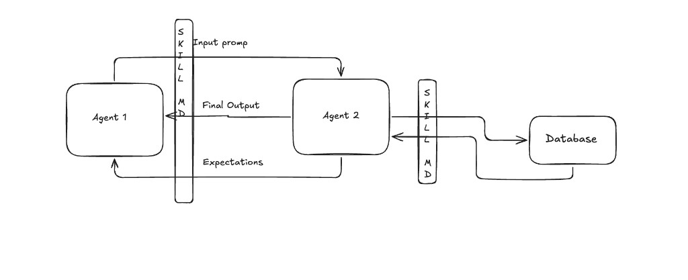

# ACP Demo — Day 9

## Two-Agent Commerce + Skill Map + Postgres Catalog

**Date:** July 12, 2026  
**Author:** Dheeraj Maske  
**Builds on:**

- [Day 1 — Handshake + Commerce Intent](./Readme_Day1.md)
- [Day 2 — Session Layer](./README_DAY2.md)
- [Day 3 — Prompt Turn + NLP Intent](./README_DAY3.md)
- [Day 4 — Catalog Search + Multi-Turn Agentic Conversation](./README_DAY4.md)
- [Day 5 — x402 USDC Payment Settlement](./README_DAY5.md)
- [Day 6 — Stripe Fiat + Dual-Rail Payment Selection](./README_DAY6.md)
- [Day 7 — ERC-8004 Trust Layer + Agent Profile UI](./README_DAY7.md)
- [Day 8 — Verifiable Intent (Auditable Intent Layer)](./README_DAY8.md)

---

## Architecture — Skill Map (your diagram)



The diagram shows **two Skill Map gates**. Nothing talks directly — every step goes through a named skill.

### Left side — Agent 1 ↔ Agent 2

| Label on diagram | Direction | What it means in the demo |
| ---------------- | --------- | ------------------------- |
| **Input prompt** | Agent 1 → Agent 2 | Buyer sends natural language over ACP `session/prompt` (e.g. “running shoes under $120”). |
| **Final output** | Agent 2 → Agent 1 | Seller returns ranked offers + `agentMessage` when requirements are complete and the DB search ran. |
| **Expectations** | Agent 2 → Agent 1 | Seller asks what is still missing — budget, product type — via the **clarification** skill before any catalog query. |

The vertical bar is the **Skill Map for conversation**: it turns a raw message into structured requirements (`query`, `max_price`, …) and decides whether to clarify or search.

**In code:** `agents/skills/clarification/SKILL.md` → `agents/seller/intent.py` → `agents/seller/prompt.py`

### Right side — Agent 2 ↔ Database

| Label on diagram | Direction | What it means in the demo |
| ---------------- | --------- | ------------------------- |
| *(search request)* | Agent 2 → Database | After clarification passes, seller calls `search_products(query, max_price, top_k=3)`. |
| *(rows back)* | Database → Agent 2 | Postgres returns real Nike rows — `id`, `name`, `price`, `score`, sizes — not hardcoded JSON. |

The second vertical bar is the **database_calling** skill. Agent 2 never hand-waves inventory; it only offers what came back from Postgres.

**In code:** `agents/skills/database_calling/SKILL.md` → `catalog/db.py` → Railway Postgres (same DB locally and in production).

### How the three arrows on the left fit together

1. Buyer opens with an **input prompt** (goal from `BUYER_PROFILE` in the demo).
2. If budget or query is missing, seller sends **expectations** — a clarification question.
3. Buyer replies; loop repeats until requirements are complete.
4. Seller runs **database_calling**, then sends **final output** — top 3 offers.
5. Agent 1 (buyer LLM) evaluates the output via `/agent/buyer/evaluate` — satisfied or ask for more.

Payment, ERC-8004, and Verifiable Intent (Days 5–8) sit **after** final output — unchanged.

---

## What we improved today

Day 9 turns the demo into a **real two-agent commerce loop**: Agent 1 (buyer) and Agent 2 (seller) talk over ACP, each driven by an LLM, with **skills** in the middle and a **Postgres catalog** behind the seller.

1. **Two agents, clear roles**
   - **Agent 1 (Buyer)** — OpenAI `gpt-4o-mini` — owns the user goal, evaluates seller turns, decides when to stop or clarify
   - **Agent 2 (Seller)** — Anthropic `claude-haiku-4-5` (OpenAI fallback) — parses buyer messages, runs skills, returns offers
2. **Skill Map** — reusable steps between agents and data
   - **clarification** — gather `query` + `max_price` before any search
   - **database_calling** — query Railway Postgres for top 3 Nike products
3. **Autonomous buyer loop** — no human typing mid-demo; buyer LLM drives replies from `BUYER_PROFILE`
4. **Postgres catalog** — Nike CSV seeded into Railway; local dev and production read the **same database** via `DATABASE_URL`
5. **Agent cost meter** — header bar shows Buyer (red) vs Seller (green) LLM spend; hover for breakdown
6. **Cost persistence** — each session’s token usage saved to `agent_session_costs` in Postgres
7. **Demo UI** — mobile header alignment, full-width prompt bar, auto-start loop after `session/new`

---


## Progress arc (Day 1 → Day 9)


| Day       | Focus                         | Key additions                                                   |
| --------- | ----------------------------- | --------------------------------------------------------------- |
| **Day 1** | Handshake + commerce          | `initialize`, `commerce/request`                                |
| **Day 2** | Session                       | `session/new`, load, resume, close                              |
| **Day 3** | Prompt turn                   | `session/prompt`, NLP intent                                    |
| **Day 4** | Catalog + multi-turn          | Offers, Claude parsing                                          |
| **Day 5** | x402 USDC                     | `commerce/pay`, wallets                                         |
| **Day 6** | Stripe fiat                   | Dual-rail payment picker                                        |
| **Day 7** | ERC-8004 trust                | Profile, 8004scan, feedback                                     |
| **Day 8** | Verifiable Intent             | Hash chain, constraint guard                                    |
| **Day 9** | Two-agent + skills + Postgres | Buyer/seller LLMs, skill map, cost meter, `agent_session_costs` |


---


## Skill chain (Agent 2)

```text
session/prompt
    → clarification skill   (missing query or budget?)
    → database_calling skill (Postgres search, top 3)
    → offers[] + intent capture (Day 8)
```

Skill docs live in `agents/skills/`:


| Skill            | File                                      |
| ---------------- | ----------------------------------------- |
| Clarification    | `agents/skills/clarification/SKILL.md`    |
| Database calling | `agents/skills/database_calling/SKILL.md` |


---


## Buyer loop (Agent 1)

```text
User goal (BUYER_PROFILE in demo.html)
    → session/new
    → autonomous loop:
         seller session/prompt
         → POST /agent/buyer/evaluate  (OpenAI)
         → goal_satisfied? stop : send next buyer message
    → offer pick + payment (Day 5–8 unchanged)
```

The buyer never falls back to regex for conversation — LLM errors surface in the UI.

---


## Postgres catalog


| Item         | Detail                                                         |
| ------------ | -------------------------------------------------------------- |
| Host         | Railway Postgres                                               |
| Seed         | `python scripts/seed_catalog.py scripts/nike_data_2022_09.csv` |
| Local        | `DATABASE_URL` in `local.env` (public Railway host)            |
| Production   | Same `DATABASE_URL` on Railway seller service                  |
| Fallback     | In-memory `catalog/data.py` if `DATABASE_URL` unset            |
| Health check | `GET /` → `catalogSource: "postgres"`, `catalogCount: 67`      |


Search API: `GET /products?query=…&max_price=…&top_k=3`

---


## Agent cost tracking

Each LLM turn records tokens and estimated USD cost. Totals roll up per session.


| Where     | What                                                        |
| --------- | ----------------------------------------------------------- |
| UI        | Header **Agent's cost** — Buyer red / Seller green          |
| In-memory | `session.context.token_usage_session` during active session |
| Postgres  | Table `agent_session_costs` keyed by `session_id`           |


**Saved on:**

- Seller `session/prompt` (intent parse)
- Buyer `POST /agent/buyer/evaluate` (when `sessionId` sent)

**Read back:**

```http
GET /session/{sessionId}/agent-cost
```

Example fields: `sellerCostUsd`, `buyerCostUsd`, `totalCostUsd`, `costStructure`, `turnLog`.

---


## Files created / reorganized


### New packages


| Path                         | Purpose                                                   |
| ---------------------------- | --------------------------------------------------------- |
| `agents/buyer/`              | Agent 1 — evaluator, orchestrator, ACP client             |
| `agents/seller/`             | Agent 2 — intent parse, prompt handler, JSON-RPC handlers |
| `agents/shared/`             | Requirements merge, token usage helpers                   |
| `agents/skills/`             | Clarification + database_calling skill specs              |
| `acp/`                       | Session manager                                           |
| `catalog/db.py`              | Postgres search                                           |
| `catalog/postgres_search.py` | Drop-in catalog backend                                   |
| `catalog/agent_cost.py`      | `agent_session_costs` table + save/read                   |
| `scripts/seed_catalog.py`    | Seed Nike CSV into Postgres                               |


### Updated


| File                 | Change                                                        |
| -------------------- | ------------------------------------------------------------- |
| `seller_agent.py`    | Thin FastAPI shell; buyer evaluate route; agent-cost endpoint |
| `demo.html`          | Autonomous step 3, cost meter, mobile header, prompt bar      |
| `payments/config.py` | Dotenv fallback without `python-dotenv`                       |


Root shims (`catalog.py`, `search.py`, `session_manager.py`) still re-export for backward compatibility.

---


## LLM split (current)


| Agent            | LLM                          | Module                      |
| ---------------- | ---------------------------- | --------------------------- |
| Agent 1 (buyer)  | OpenAI `gpt-4o-mini`         | `agents/buyer/evaluator.py` |
| Agent 2 (seller) | Anthropic `claude-haiku-4-5` | `agents/seller/intent.py`   |


Env overrides: `OPENAI_BUYER_MODEL`, `ANTHROPIC_MODEL`, `OPENAI_MODEL`.

---


## Run locally

```bash
# Seller (Agent 2) — needs DATABASE_URL, API keys in local.env
python seller_agent.py

# Open demo
open http://localhost:8002/demo.html

# CLI buyer ↔ seller loop
python -m agents.buyer.orchestrator "running shoes under $150"

# Seed / refresh catalog
python scripts/seed_catalog.py scripts/nike_data_2022_09.csv
```

Required in `local.env`:

```bash
DATABASE_URL=postgresql://…@….railway.app:…/railway   # public host, not .internal
OPENAI_API_KEY=sk-…
ANTHROPIC_API_KEY=sk-ant-…
```

---


## Demo vs production


| Feature                        | Demo      | Production-grade                 |
| ------------------------------ | --------- | -------------------------------- |
| Two-agent LLM loop             | ✅         | ✅ pattern                        |
| Skill map (clarification → DB) | ✅         | ✅                                |
| Postgres catalog               | ✅ Railway | Dedicated catalog service        |
| Session cost in Postgres       | ✅         | Billing / observability pipeline |
| Sessions in memory             | ✅         | Redis / Postgres                 |
| Intent store in memory         | ✅ (Day 8) | Durable audit log                |
| Buyer on separate server       | ❌         | Split :8001 buyer service        |


---


## Live links

- **Frontend:** [dheeraj-agentic-communication-demo.netlify.app](https://dheeraj-agentic-communication-demo.netlify.app)
- **Backend:** [acp-demo-production.up.railway.app](https://acp-demo-production.up.railway.app)
- **Health:** `GET /` → catalog + wallet status
- **Session cost:** `GET /session/{sessionId}/agent-cost`

---


## Quick reference — all README files


| File                               | What it covers                            |
| ---------------------------------- | ----------------------------------------- |
| [README.md](./README.md)           | Project overview + quick start            |
| [Readme_Day1.md](./Readme_Day1.md) | Handshake, commerce/request               |
| [README_DAY2.md](./README_DAY2.md) | Session layer                             |
| [README_DAY3.md](./README_DAY3.md) | session/prompt, NLP intent                |
| [README_DAY4.md](./README_DAY4.md) | Catalog, multi-turn, Claude               |
| [README_DAY5.md](./README_DAY5.md) | x402 USDC, wallets                        |
| [README_DAY6.md](./README_DAY6.md) | Stripe fiat, payment picker               |
| [README_DAY7.md](./README_DAY7.md) | ERC-8004 trust, profile UI                |
| [README_DAY8.md](./README_DAY8.md) | Verifiable Intent, hash chain             |
| [README_DAY9.md](./README_DAY9.md) | Two-agent skills, Postgres, cost tracking |


